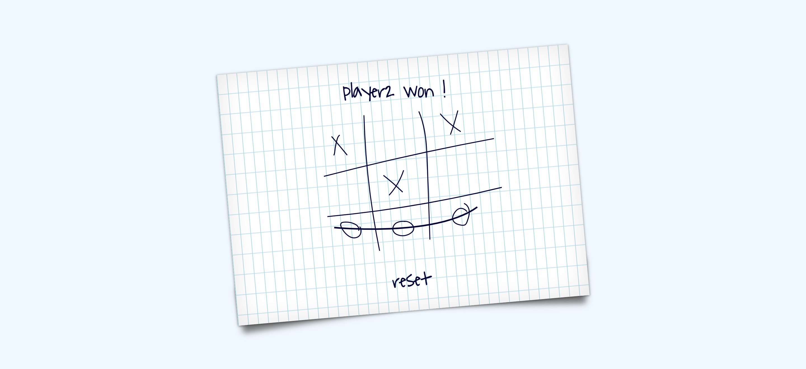

# Tic-Tac-Toe
This a JavaScript Tic Tac Toe Game. Interface built using HTML5, CSS3 and CSS Media queries, where you can play with your opponent as well as you can play with computer itself.

HTML-> Used to build the website structure.

CSS-> Used to style the contents of the webpage.

CSS Media queries-> Used to build responsive site.

JavaScript-> Used to build the backend game working.

